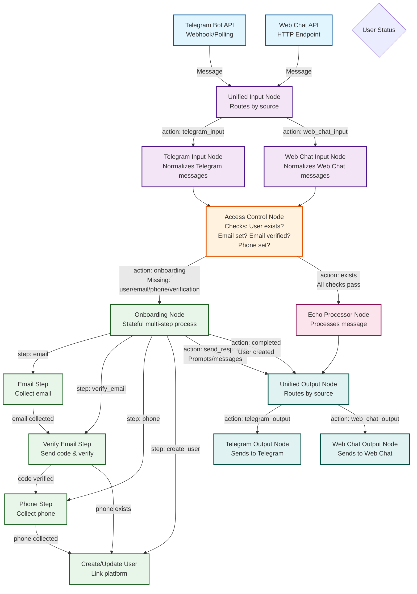
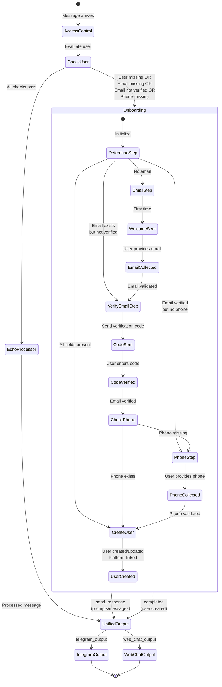
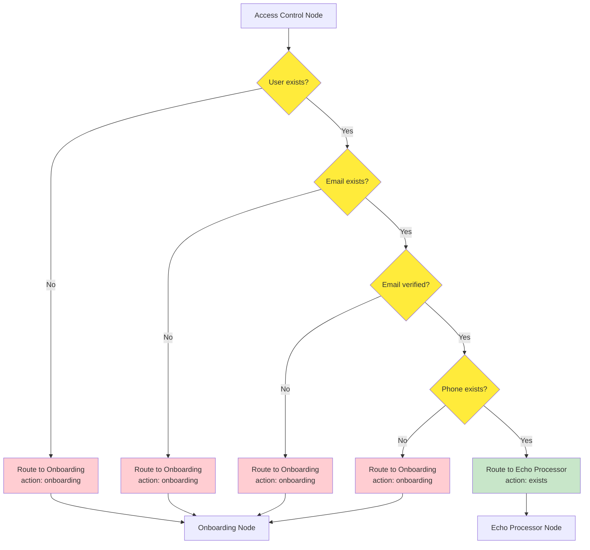
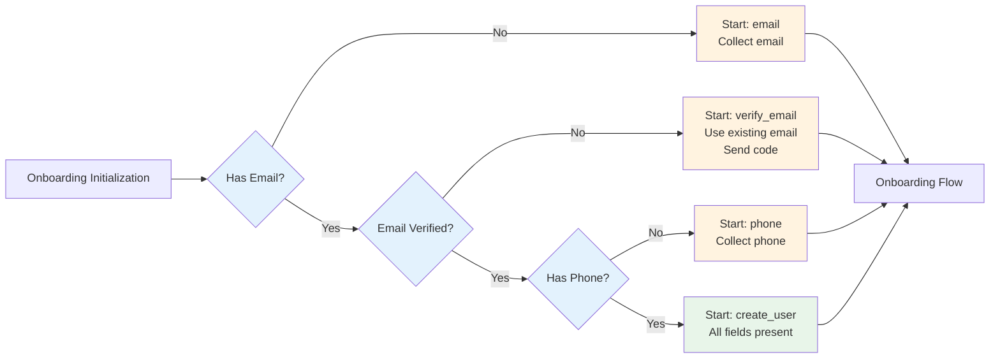
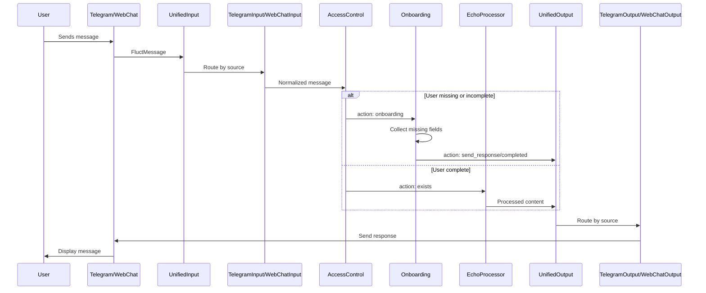

# FluctBot - Complete Workflow Diagram

This document provides a comprehensive visual representation of the FluctBot workflow system, showing all nodes, connections, and decision points.

## Main Workflow Architecture

## Detailed Onboarding Flow

## Access Control Decision Tree

## Onboarding Step Determination Logic

## Message Flow Sequence

## Node Types and Responsibilities

### Input Nodes
- **Unified Input Node**: Routes messages to platform-specific input nodes based on source
- **Telegram Input Node**: Converts Telegram messages to FluctMessage format
- **Web Chat Input Node**: Converts Web Chat messages to FluctMessage format

### Control Nodes
- **Access Control Node**: Validates user existence and required fields (email, email verification, phone)

### Processor Nodes
- **Onboarding Node**: Stateful multi-step process for user registration/update
  - Email collection
  - Email verification (code-based)
  - Phone collection
  - User creation/update
- **Echo Processor Node**: Simple message echo for existing users

### Output Nodes
- **Unified Output Node**: Routes responses to platform-specific output nodes
- **Telegram Output Node**: Sends messages back to Telegram
- **Web Chat Output Node**: Sends messages back to Web Chat

## Key Features

1. **Multi-Source Support**: Handles messages from Telegram and Web Chat (extensible to WhatsApp)
2. **Smart Routing**: Automatically routes based on message source
3. **Access Control**: Validates user completeness before processing
4. **Intelligent Onboarding**: Only collects missing fields, skips completed steps
5. **Stateful Onboarding**: Maintains state across multiple user interactions
6. **Extensible Architecture**: Easy to add new nodes, processors, and sources

## Workflow Execution Pattern

All nodes follow the `prep -> exec -> post` pattern:

1. **prep()**: Prepare data from shared context
2. **exec()**: Execute node logic, return action
3. **post()**: Post-process, update shared context, return routing action

The workflow engine orchestrates node execution based on connections and returned actions.

