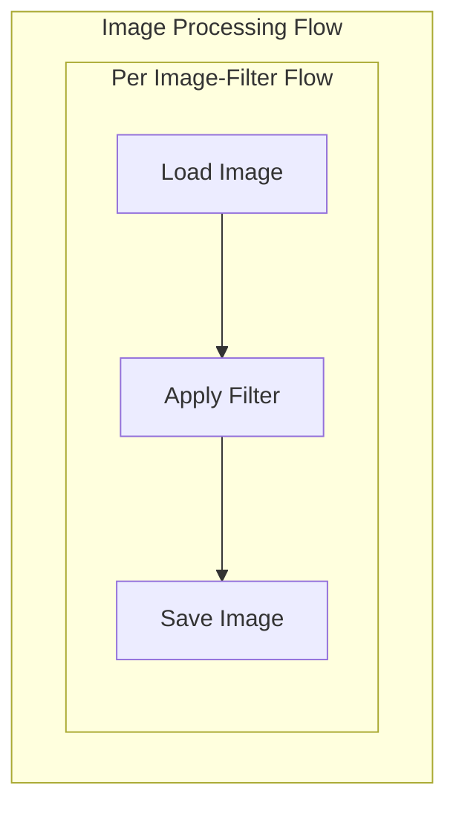

# Parallel Image Processor

Demonstrates how AsyncParallelBatchFlow processes multiple images with multiple filters >8x faster than sequential processing.

## Features



- Processes images with multiple filters in parallel
- Applies three different filters (grayscale, blur, sepia)
- Shows significant speed improvement over sequential processing
- Manages system resources with semaphores

## Run It

```bash
npm install
npm run start
```

## Output

```
Starting Image Filter Application...
Scanning for images in C:\WorkSpace\PocketFlow-Typescript\cookbook\pocketflow-parallel-batch-flow\src\images
Found 3 images to process
Created 9 image processing tasks
Processing bird.jpg with blur filter
Processing bird.jpg with grayscale filter
Processing bird.jpg with sepia filter
Processing cat.jpg with blur filter
Processing cat.jpg with grayscale filter
Processing cat.jpg with sepia filter
Processing dog.jpg with blur filter
Processing dog.jpg with grayscale filter
Processing dog.jpg with sepia filter
Successfully processed 3 images
Report generated at report.txt
Image processing completed successfully!
Processed 3 images with 3 filters (blur, grayscale, sepia).
Output files and report can be found in the 'output' directory.
```

## Key Points

- **Sequential**: Total time = sum of all item times

  - Good for: Rate-limited APIs, maintaining order

- **Parallel**: Total time ≈ longest single item time
  - Good for: I/O-bound tasks, independent operations
