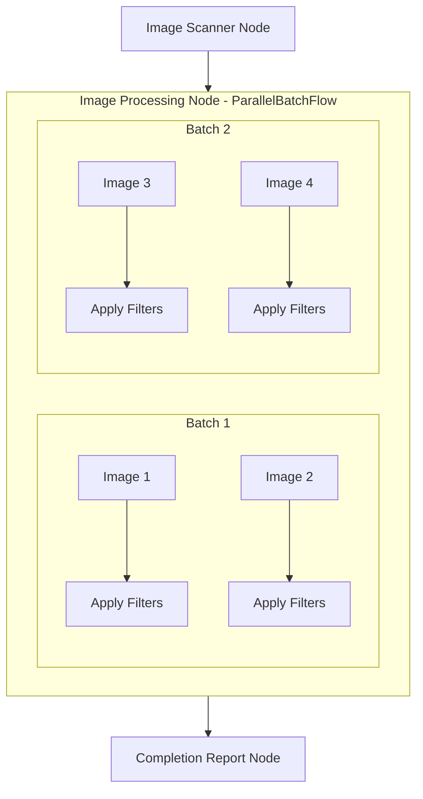

# Design Doc: Image Filter Application

> Please DON'T remove notes for AI

## Requirements

> Notes for AI: Keep it simple and clear.
> If the requirements are abstract, write concrete user stories

1. The application must process multiple images located in the src/images directory
2. Three filters must be applied to each image: blur, grayscale, and sepia
3. Each image must be processed with all three filters, generating three output images
4. All processed images must be saved in an output folder with naming pattern originalName_filterName
5. Image processing must be parallelized using ParallelBatchFlow for efficiency
6. The application must generate a report of all processed images
7. The application must be compatible with Node.js environments

**User Stories:**

- As a user, I want to process multiple images with different filters so I can choose the best visual effect
- As a user, I want the processing to happen in parallel to save time
- As a user, I want processed images to be named consistently so I can easily identify them
- As a user, I want a report of all processed images to track what was done
- As a user, I want the application to run in any Node.js environment without special dependencies

## Technology Stack

- **Node.js**: Runtime environment
- **TypeScript**: Programming language
- **PocketFlow**: Framework for parallel processing
- **Sharp**: High-performance image processing library for Node.js

## Flow Design

> Notes for AI:
>
> 1. Consider the design patterns of agent, map-reduce, rag, and workflow. Apply them if they fit.
> 2. Present a concise, high-level description of the workflow.

### Applicable Design Pattern:

ParallelBatchFlow is perfect for this use case because:

1. Each image needs the same set of filters applied (consistent workload)
2. The filter operations are independent and can run in parallel
3. Batch processing provides efficient resource utilization

### Flow high-level Design:

1. **Image Scanner Node**: Finds all images in src/images directory
2. **Image Processing Node**: Uses ParallelBatchFlow to apply filters to images
3. **Completion Report Node**: Generates a report of all processed images



## Utility Functions

> Notes for AI:
>
> 1. Understand the utility function definition thoroughly by reviewing the doc.
> 2. Include only the necessary utility functions, based on nodes in the flow.

1. **Read Directory** (`src/utils/read_directory.ts`)

   - _Input_: directoryPath (string)
   - _Output_: files (string[])
   - _Implementation_: Uses Node.js fs module to read directory and filter for image files
   - Used by Image Scanner Node to get all image files

2. **Image Processing** (`src/utils/process_image.ts`)
   - _Input_: imagePath (string), filter (string)
   - _Output_: processedImagePath (string)
   - _Implementation_: Uses Sharp library to apply filters to images
   - Filter implementations:
     - Blur: Uses Sharp's blur function with radius 5
     - Grayscale: Uses Sharp's built-in grayscale function
     - Sepia: Uses Sharp's recomb function with a sepia color matrix
   - Used by Image Processing Node to apply filters to images

## Node Design

### Shared Memory

> Notes for AI: Try to minimize data redundancy

The shared memory structure is organized as follows:

```typescript
interface SharedData {
  // Input data
  inputImages: string[]; // Paths to input images

  // Processing data
  filters: string[]; // List of filters to apply (blur, grayscale, sepia)

  // Output data
  outputFolder: string; // Path to output folder
  processedImages: {
    // Tracking processed images
    imagePath: string;
    appliedFilters: string[];
  }[];
}
```

### Node Steps

> Notes for AI: Carefully decide whether to use Batch/Async Node/Flow.

1. Image Scanner Node

- _Purpose_: Scan the src/images directory to find all input images
- _Type_: Regular
- _Steps_:
  - _prep_: Initialize empty inputImages array in shared store
  - _exec_: Read all files from src/images directory, filter for image files
  - _post_: Write image paths to inputImages in shared store and initialize filters array with ["blur", "grayscale", "sepia"]

2. Image Processing Node

- _Purpose_: Apply filters to images in parallel
- _Type_: ParallelBatchFlow
- _Batch Configuration_:
  - _itemsPerBatch_: 5 (process 5 images at a time)
  - _concurrency_: 3 (run 3 parallel batches)
- _Sub-flow_:
  - Apply Filter Node (for each image)
    - _Type_: Batch
    - _Input_: Single image path and array of filters
    - _Steps_:
      - _prep_: Load the image data using Sharp
      - _exec_: For each filter, apply the filter to the image using Sharp's API
      - _post_: Save processed images to output folder with naming pattern originalName_filterName

3. Completion Report Node

- _Purpose_: Generate a report of all processed images
- _Type_: Regular
- _Steps_:
  - _prep_: Read processedImages from shared store
  - _exec_: Generate a summary report of all images and filters applied
  - _post_: Write report to output folder
