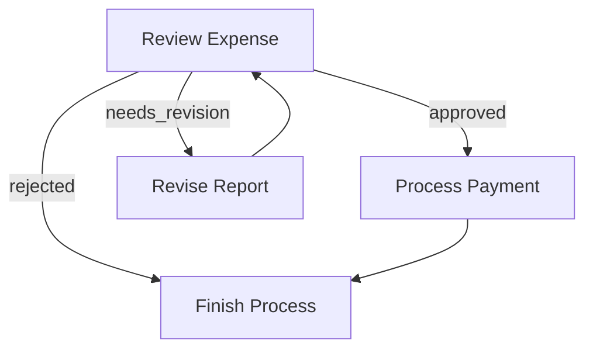
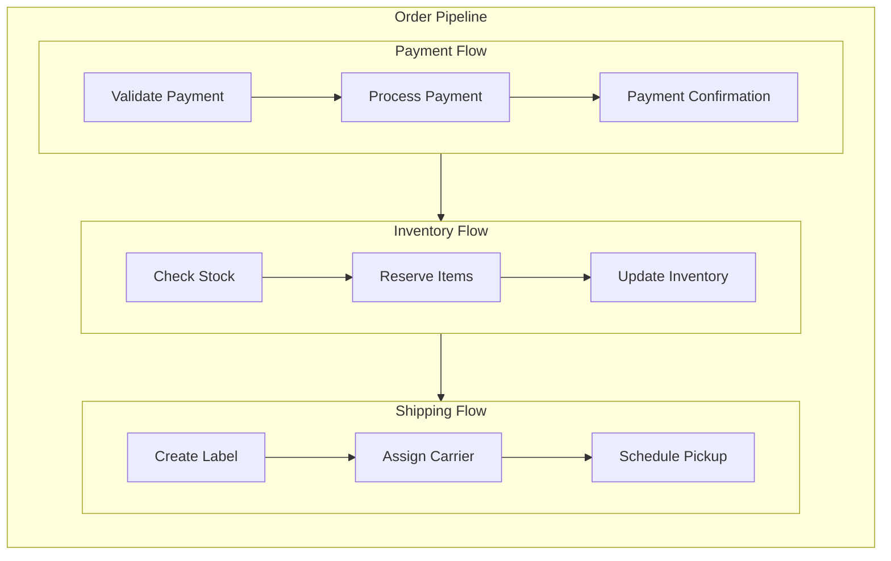

# Flow

A **Flow** orchestrates a graph of Nodes. You can chain Nodes in a sequence or create branching depending on the **Actions** returned from each Node's `post()`.

## 1. Action-based Transitions

Each Node's `post()` returns an **Action** string. By default, if `post()` doesn't return anything, we treat that as `"default"`.

You define transitions with the syntax:

1. **Basic default transition**: `nodeA.next(nodeB)`
   This means if `nodeA.post()` returns `"default"`, go to `nodeB`.
   (Equivalent to `nodeA.on("default", nodeB)`)

2. **Named action transition**: `nodeA.on("actionName", nodeB)`
   This means if `nodeA.post()` returns `"actionName"`, go to `nodeB`.

It's possible to create loops, branching, or multi-step flows.

## 2. Method Chaining

The transition methods support **chaining** for more concise flow creation:

### Chaining `on()` Methods

The `on()` method returns the current node, so you can chain multiple action definitions:

```typescript
// All transitions from the same node
nodeA.on("approved", nodeB).on("rejected", nodeC).on("needs_review", nodeD);

// Equivalent to:
nodeA.on("approved", nodeB);
nodeA.on("rejected", nodeC);
nodeA.on("needs_review", nodeD);
```

### Chaining `next()` Methods

The `next()` method returns the target node, allowing you to create linear sequences in a single expression:

```typescript
// Creates a linear A → B → C → D sequence
nodeA.next(nodeB).next(nodeC).next(nodeD);

// Equivalent to:
nodeA.next(nodeB);
nodeB.next(nodeC);
nodeC.next(nodeD);
```

### Combining Chain Types

You can combine both chaining styles for complex flows:

```typescript
nodeA
  .on("action1", nodeB.next(nodeC).next(nodeD))
  .on("action2", nodeE.on("success", nodeF).on("failure", nodeG));
```

## 3. Creating a Flow

A **Flow** begins with a **start** node. You call `const flow = new Flow(someNode)` to specify the entry point. When you call `flow.run(shared)`, it executes the start node, looks at its returned Action from `post()`, follows the transition, and continues until there's no next node.

### Example: Simple Sequence

Here's a minimal flow of two nodes in a chain:

```typescript
nodeA.next(nodeB);
const flow = new Flow(nodeA);
flow.run(shared);
```

- When you run the flow, it executes `nodeA`.
- Suppose `nodeA.post()` returns `"default"`.
- The flow then sees `"default"` Action is linked to `nodeB` and runs `nodeB`.
- `nodeB.post()` returns `"default"` but we didn't define a successor for `nodeB`. So the flow ends there.

### Example: Branching & Looping

Here's a simple expense approval flow that demonstrates branching and looping. The `ReviewExpense` node can return three possible Actions:

- `"approved"`: expense is approved, move to payment processing
- `"needs_revision"`: expense needs changes, send back for revision
- `"rejected"`: expense is denied, finish the process

We can wire them like this:

```typescript
// Define the flow connections
review.on("approved", payment); // If approved, process payment
review.on("needs_revision", revise); // If needs changes, go to revision
review.on("rejected", finish); // If rejected, finish the process

revise.next(review); // After revision, go back for another review
payment.next(finish); // After payment, finish the process

const flow = new Flow(review);
```

Let's see how it flows:

1. If `review.post()` returns `"approved"`, the expense moves to the `payment` node
2. If `review.post()` returns `"needs_revision"`, it goes to the `revise` node, which then loops back to `review`
3. If `review.post()` returns `"rejected"`, it moves to the `finish` node and stops



### Running Individual Nodes vs. Running a Flow

- `node.run(shared)`: Just runs that node alone (calls `prep->exec->post()`), returns an Action.
- `flow.run(shared)`: Executes from the start node, follows Actions to the next node, and so on until the flow can't continue.

> `node.run(shared)` **does not** proceed to the successor.
> This is mainly for debugging or testing a single node.
>
> Always use `flow.run(...)` in production to ensure the full pipeline runs correctly.
{: .warning }

## 4. Nested Flows

A **Flow** can act like a Node, which enables powerful composition patterns. This means you can:

1. Use a Flow as a Node within another Flow's transitions.
2. Combine multiple smaller Flows into a larger Flow for reuse.
3. Node `params` will be a merging of **all** parents' `params`.

### Flow's Node Methods

A **Flow** is also a **Node**, so it will run `prep()` and `post()`. However:

- It **won't** run `exec()`, as its main logic is to orchestrate its nodes.
- `post()` always receives `undefined` for `execRes` and should instead get the flow execution results from the shared store.

### Basic Flow Nesting

Here's how to connect a flow to another node:

```typescript
// Create a sub-flow
nodeA.next(nodeB);
const subflow = new Flow(nodeA);

// Connect it to another node
subflow.next(nodeC);

// Create the parent flow
const parentFlow = new Flow(subflow);
```

When `parentFlow.run()` executes:

1. It starts `subflow`
2. `subflow` runs through its nodes (`nodeA->nodeB`)
3. After `subflow` completes, execution continues to `nodeC`

### Example: Order Processing Pipeline

Here's a practical example that breaks down order processing into nested flows:

```typescript
// Payment processing sub-flow
validatePayment.next(processPayment).next(paymentConfirmation);
const paymentFlow = new Flow(validatePayment);

// Inventory sub-flow
checkStock.next(reserveItems).next(updateInventory);
const inventoryFlow = new Flow(checkStock);

// Shipping sub-flow
createLabel.next(assignCarrier).next(schedulePickup);
const shippingFlow = new Flow(createLabel);

// Connect the flows into a main order pipeline
paymentFlow.next(inventoryFlow).next(shippingFlow);

// Create the master flow
const orderPipeline = new Flow(paymentFlow);

// Run the entire pipeline
orderPipeline.run(sharedData);
```

This creates a clean separation of concerns while maintaining a clear execution path:


