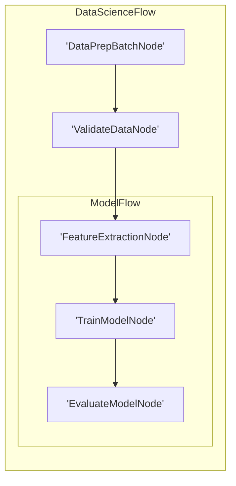

# Visualization and Debugging

Similar to LLM wrappers, we **don't** provide built-in visualization and debugging. Here, we recommend some _minimal_ (and incomplete) implementations These examples can serve as a starting point for your own tooling.

## 1. Visualization with Mermaid

### Using the Official Mermaid Library (Recommended)

The [mermaid library](https://github.com/mermaid-js/mermaid) is a very popular (76K+ stars) TypeScript library for creating diagrams from text. We recommend using it for visualization in production projects.

First, install the library:

```bash
npm install mermaid
# or
yarn add mermaid
# or
pnpm add mermaid
```

Then, you can use it to generate diagrams from your flow structure:

```typescript
import { BaseNode, Flow } from "../src/index";
import mermaid from "mermaid";

function generateFlowDiagram(start: BaseNode): string {
  // Configure mermaid
  mermaid.initialize({
    startOnLoad: false,
    theme: "default",
  });

  // Generate mermaid diagram definition
  const diagram = buildMermaidDefinition(start);

  // You can then render this diagram in a web context
  // or export it to SVG/PNG using mermaid's rendering capabilities
  return diagram;
}

// Helper function to build mermaid definition
function buildMermaidDefinition(start: BaseNode): string {
  // This is where we'll put our custom code to traverse the flow
  // and build a mermaid diagram definition
  // The implementation is similar to our custom approach below
  // [Implementation of custom traversal to generate mermaid diagram definition]
  // For a simple implementation example, see the custom approach below
  // The function returns a string containing the mermaid diagram definition
  // which can be rendered by the mermaid library
}
```

For rendering in a browser environment:

```typescript
// In a web context
const element = document.querySelector("#diagram");
mermaid.render("diagram-id", diagramDefinition, (svgCode) => {
  element.innerHTML = svgCode;
});
```

### Custom Implementation Alternative

If you prefer a custom lightweight implementation, this code recursively traverses the nested graph, assigns unique IDs to each node, and treats Flow nodes as subgraphs to generate Mermaid syntax for a hierarchical visualization:



```typescript
import { BaseNode, Flow } from "../src/index";

type NodeIds = Map<BaseNode, string>;

function buildMermaid(start: BaseNode): string {
  const ids: NodeIds = new Map();
  const visited: Set<BaseNode> = new Set();
  const lines: string[] = ["graph LR"];
  let ctr = 1;

  function getId(node: BaseNode): string {
    if (ids.has(node)) {
      return ids.get(node)!;
    }
    const id = `N${ctr++}`;
    ids.set(node, id);
    return id;
  }

  function link(a: string, b: string): void {
    lines.push(`    ${a} --> ${b}`);
  }

  function walk(node: BaseNode, parent?: string): void {
    if (visited.has(node)) {
      if (parent) link(parent, getId(node));
      return;
    }

    visited.add(node);

    if (node instanceof Flow) {
      if (node.start && parent) {
        link(parent, getId(node.start));
      }

      lines.push(
        `\n    subgraph sub_flow_${getId(node)}[${node.constructor.name}]`
      );

      if (node.start) {
        walk(node.start);
      }

      // Get all successors from the node's internal map
      const successors = Array.from((node as any)._successors.entries());

      for (const [_, nextNode] of successors) {
        if (node.start) {
          walk(nextNode, getId(node.start));
        } else if (parent) {
          link(parent, getId(nextNode));
        } else {
          walk(nextNode);
        }
      }

      lines.push("    end\n");
    } else {
      const nodeId = getId(node);
      lines.push(`    ${nodeId}['${node.constructor.name}']`);

      if (parent) {
        link(parent, nodeId);
      }

      // Get all successors from the node's internal map
      const successors = Array.from((node as any)._successors.entries());

      for (const [_, nextNode] of successors) {
        walk(nextNode, nodeId);
      }
    }
  }

  walk(start);
  return lines.join("\n");
}
```



For example, suppose we have a complex Flow for data science:

```typescript
import { BaseNode, BatchNode, Node, Flow } from "../src/index";

class DataPrepBatchNode extends BatchNode {
  prep(shared: any): any[] {
    return [];
  }
}
class ValidateDataNode extends Node {}
class FeatureExtractionNode extends Node {}
class TrainModelNode extends Node {}
class EvaluateModelNode extends Node {}
class ModelFlow extends Flow {}
class DataScienceFlow extends Flow {}

const featureNode = new FeatureExtractionNode();
const trainNode = new TrainModelNode();
const evaluateNode = new EvaluateModelNode();
featureNode.next(trainNode);
trainNode.next(evaluateNode);
const modelFlow = new ModelFlow(featureNode);

const dataPrepNode = new DataPrepBatchNode();
const validateNode = new ValidateDataNode();
dataPrepNode.next(validateNode);
validateNode.next(modelFlow);
const dataScienceFlow = new DataScienceFlow(dataPrepNode);

const result = buildMermaid(dataScienceFlow);
```

The code generates a Mermaid diagram:



## 2. Call Stack Debugging

There are several approaches to debug and trace execution in your flow application. Here are some recommended methods:

### Method 1: Using Decorators for Tracing (Recommended)

TypeScript decorators provide a clean way to add tracing functionality to your methods. This approach is more maintainable and flexible than manipulating the stack trace:

```typescript
import { BaseNode } from "../src/index";

// A simple tracing decorator that logs method execution
function trace(
  target: any,
  propertyKey: string,
  descriptor: PropertyDescriptor
) {
  const originalMethod = descriptor.value;

  descriptor.value = function (...args: any[]) {
    const nodeName = this.constructor.name;
    console.log(`Entering ${nodeName}.${propertyKey}`);

    try {
      const result = originalMethod.apply(this, args);
      console.log(`Exiting ${nodeName}.${propertyKey}`);
      return result;
    } catch (error) {
      console.error(`Error in ${nodeName}.${propertyKey}:`, error);
      throw error;
    }
  };

  return descriptor;
}

// Usage example
class MyNode extends BaseNode {
  @trace
  async prep(shared: any): Promise<any> {
    // Implementation
    return {};
  }

  @trace
  async exec(prepRes: any): Promise<any> {
    // Implementation
    return {};
  }

  @trace
  async post(
    shared: any,
    prepRes: any,
    execRes: any
  ): Promise<string | undefined> {
    // Implementation
    return "default";
  }
}
```

### Method 2: Stack Inspection

If you need to examine the call stack during runtime, you can implement a utility function that parses the Error stack trace:

```typescript
import { BaseNode } from "../src/index";

function getNodeCallStack(): string[] {
  const stack = new Error().stack || "";
  const stackLines = stack.split("\n").slice(1); // Skip the Error constructor line
  const nodeNames: string[] = [];
  const seenNodeIds = new Set<number>();

  // Regular expression to match the function names
  const functionNameRegex = /at\s+(\w+)\.(\w+)/;

  for (const line of stackLines) {
    const match = line.match(functionNameRegex);
    if (match) {
      // Try to find this.constructor.name in the stack frames
      // This is less precise than Python's inspect module, but can work
      // for basic stack tracing
      try {
        const instance = Function("return this")();
        if (instance instanceof BaseNode && !seenNodeIds.has(instance.nodeId)) {
          seenNodeIds.add(instance.nodeId);
          nodeNames.push(instance.constructor.name);
        }
      } catch (e) {
        // Unable to get instance from this context, continue
      }
    }
  }

  return nodeNames;
}
```

### Method 3: Using Existing Debugging Libraries

For production applications, consider using established debugging and tracing libraries:

```typescript
import debug from "debug"; // npm install debug
import { BaseNode } from "../src/index";

// Create debuggers for different aspects of your application
const prepDebug = debug("flow:prep");
const execDebug = debug("flow:exec");
const postDebug = debug("flow:post");

class DebuggableNode extends BaseNode {
  async prep(shared: any): Promise<any> {
    prepDebug(`${this.constructor.name} prep started with shared:`, shared);
    const result = await super.prep(shared);
    prepDebug(`${this.constructor.name} prep completed with result:`, result);
    return result;
  }

  async exec(prepRes: any): Promise<any> {
    execDebug(`${this.constructor.name} exec started with:`, prepRes);
    const result = await super.exec(prepRes);
    execDebug(`${this.constructor.name} exec completed with:`, result);
    return result;
  }

  async post(
    shared: any,
    prepRes: any,
    execRes: any
  ): Promise<string | undefined> {
    postDebug(`${this.constructor.name} post started`);
    const result = await super.post(shared, prepRes, execRes);
    postDebug(`${this.constructor.name} post completed with action:`, result);
    return result;
  }
}
```

To enable debugging, run your application with the DEBUG environment variable:

```bash
# Enable all flow debugging
DEBUG=flow:* node your-app.js

# Enable only specific parts
DEBUG=flow:prep,flow:post node your-app.js
```

### Example with Custom EvaluateModelNode

Here's a complete example using our original approach:

```typescript
import { BaseNode, BatchNode, Node, Flow } from "../src/index";

class DataPrepBatchNode extends BatchNode {
  prep(shared: any): any[] {
    return [];
  }
}
class ValidateDataNode extends Node {}
class FeatureExtractionNode extends Node {}
class TrainModelNode extends Node {}
class EvaluateModelNode extends Node {
  prep(shared: any): void {
    const stack = getNodeCallStack();
    console.log("Call stack:", stack);
  }
}
class ModelFlow extends Flow {}
class DataScienceFlow extends Flow {}

const featureNode = new FeatureExtractionNode();
const trainNode = new TrainModelNode();
const evaluateNode = new EvaluateModelNode();
featureNode.next(trainNode);
trainNode.next(evaluateNode);
const modelFlow = new ModelFlow(featureNode);

const dataPrepNode = new DataPrepBatchNode();
const validateNode = new ValidateDataNode();
dataPrepNode.next(validateNode);
validateNode.next(modelFlow);
const dataScienceFlow = new DataScienceFlow(dataPrepNode);

dataScienceFlow.run({});
```

The output would be: `Call stack: ['EvaluateModelNode', 'ModelFlow', 'DataScienceFlow']`

> Note: Each debugging approach has its strengths and limitations. The decorator-based approach offers the cleanest integration but requires TypeScript configuration with decorator support. The debug library approach is ideal for production systems with configurable logging levels.
